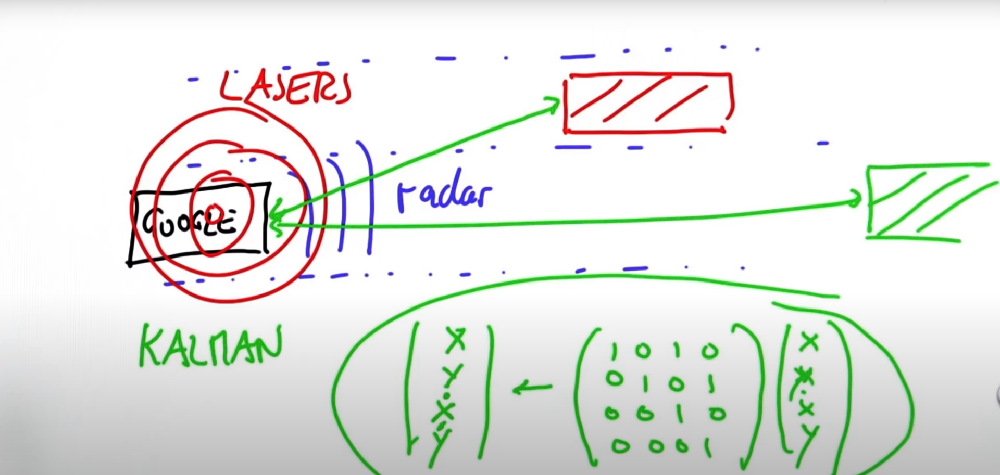
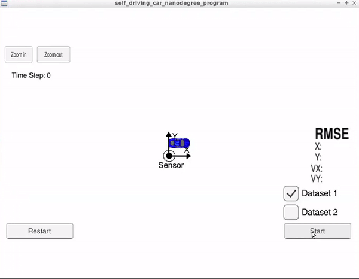
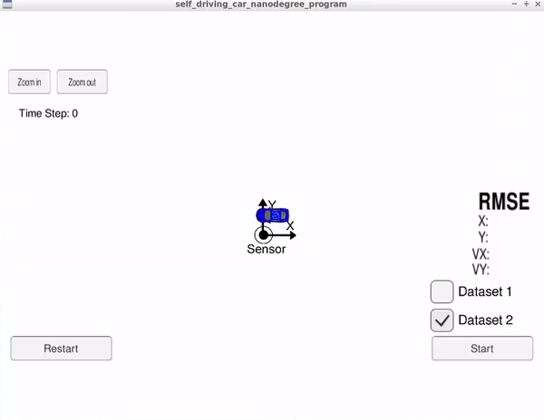
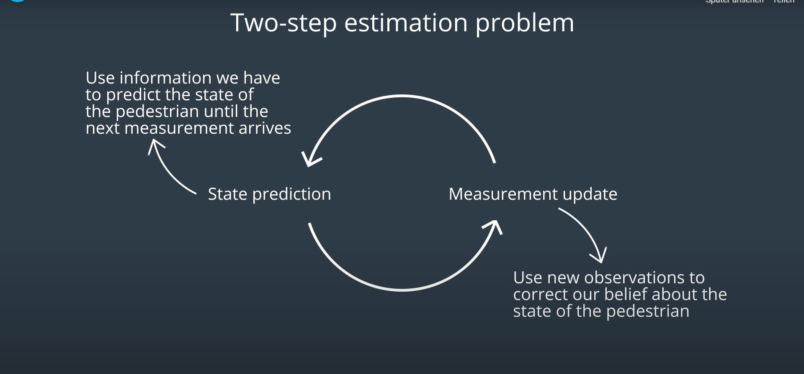
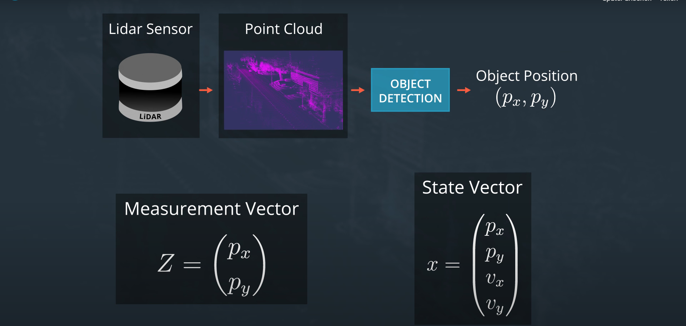
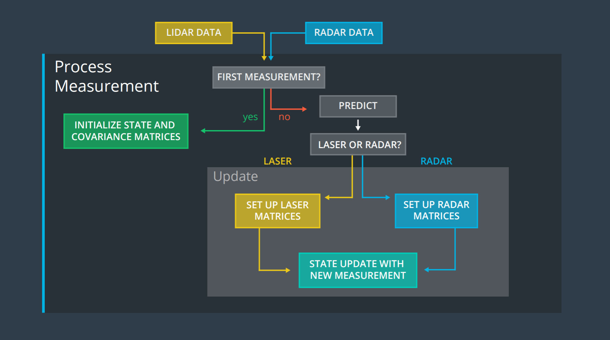

---------------------------------------------------------------------------------------------------------------------

by Batuhan Alkan submitted on June 2021

---------------------------------------------------------------------------------------------------------------------

# Extended Kalman Filter Project Starter Code
Self-Driving Car Engineer Nanodegree Program

In this project you will utilize a kalman filter to estimate the state of a moving object of interest with noisy lidar and radar measurements. Passing the project requires obtaining RMSE values that are lower than the tolerance outlined in the project rubric. 

This project involves the Term 2 Simulator which can be downloaded [here](https://github.com/udacity/self-driving-car-sim/releases)

This repository includes two files that can be used to set up and install [uWebSocketIO](https://github.com/uWebSockets/uWebSockets) for either Linux or Mac systems. For windows you can use either Docker, VMware, or even [Windows 10 Bash on Ubuntu](https://www.howtogeek.com/249966/how-to-install-and-use-the-linux-bash-shell-on-windows-10/) to install uWebSocketIO. Please see the uWebSocketIO Starter Guide page in the classroom within the EKF Project lesson for the required version and installation scripts.

Once the install for uWebSocketIO is complete, the main program can be built and run by doing the following from the project top directory.

1. mkdir build
2. cd build
3. cmake ..
4. make
5. ./ExtendedKF

Note that the programs that need to be written to accomplish the project are src/FusionEKF.cpp, src/FusionEKF.h, kalman_filter.cpp, kalman_filter.h, tools.cpp, and tools.h

# OUTPUT 

# DATASET 1

# DATASET 2

# What ist Kalman Filter ?

Kalman filtering is an algorithm that provides estimates of some unknown variables given the measurements observed over time. Kalman filters have been demonstrating its usefulness in various applications. Kalman filters have relatively simple form and require small computational power. However, it is still not easy for people who are not familiar with estimation theory to understand and implement the Kalman filters. Whereas there exist some excellent literatures such as  addressing derivation and theory behind the Kalman filter, this chapter focuses on a more practical perspective.

The Kalman Filter algorithm will go through the following steps:

•	first measurement - the filter will receive initial measurements of the bicycle's position relative to the car. These measurements will come from a radar or lidar sensor.

•	initialize state and covariance matrices - the filter will initialize the bicycle's position based on the first measurement.

•	then the car will receive another sensor measurement after a time period \Delta{t}Δt.

•	predict - the algorithm will predict where the bicycle will be after time \Delta{t}Δt.
One basic way to predict the bicycle location after \Delta{t}Δt is to assume the bicycle's velocity is constant; thus the bicycle will have moved velocity * \Delta{t}Δt. In the extended Kalman filter lesson, we will assume the velocity is constant.

•	update - the filter compares the "predicted" location with what the sensor measurement says. The predicted location and the measured location are combined to give an updated location. The Kalman filter will put more weight on either the predicted location or the measured location depending on the uncertainty of each value.
•	then the car will receive another sensor measurement after a time period \Delta{t}Δt. The algorithm then does another predict and update step.

•	x is the mean state vector. For an extended Kalman filter, the mean state vector contains information about the object's position and velocity that you are tracking. It is called the "mean" state vector because position and velocity are represented by a gaussian distribution with mean x.

•	P is the state covariance matrix, which contains information about the uncertainty of the object's position and velocity. You can think of it as containing standard deviations.

•	k represents time steps. So x_k refers to the object's position and velocity vector at time k.

•	The notation k+1|kk+1∣k refers to the prediction step. At time k+1k+1, you receive a sensor measurement. Before taking into account the sensor measurement to update your belief about the object's position and velocity, you predict where you think the object will be at time k+1k+1. You can predict the position of the object at k+1 based on its position and velocity at time kk. Hence x_{k+1|k}xk+1∣k means that you have predicted where the object will be at k+1 but have not yet taken the sensor measurement into account.

•	x_{k+1} means that you have now predicted where the object will be at time k+1 and then used the sensor measurement to update the object's position and velocity.

# Prediction

The x' = Fx + \nux′=Fx+ν equation does these prediction calculations for us.

But maybe the object didn't maintain the exact same velocity. Maybe the object changed direction, accelerated or decelerated. So when we predict the position one second later, our uncertainty increases. P' = FP^T + QP′=FP+Q represents this increase in uncertainty.
Process noise refers to the uncertainty in the prediction step. We assume the object travels at a constant velocity, but in reality, the object might accelerate or decelerate. The notation  N(0, Q)ν∼N(0,Q) defines the process noise as a gaussian distribution with mean zero and covariance Q.

# Update

Now we get some sensor information that tells where the object is relative to the car. First we compare where we think we are with what the sensor data tells us y = z - Hx'y=z−Hx′.

The KK matrix, often called the Kalman filter gain, combines the uncertainty of where we think we are P′ with the uncertainty of our sensor measurement R. If our sensor measurements are very uncertain (R is high relative to P'), then the Kalman filter will give more weight to where we think we are: x′. If where we think we are is uncertain (P' is high relative to R), the Kalman filter will put more weight on the sensor measurement: z.

Measurement noise refers to uncertainty in sensor measurements. The notation  N(0, R)ω ∼ N(0,R) defines the measurement noise as a gaussian distribution with mean zero and covariance R. Measurement noise comes from uncertainty in sensor measurements.

B is a matrix called the control input matrix and uu is the control vector.

As an example, let's say we were tracking a car and we knew for certain how much the car's motor was going to accelerate or decelerate over time; in other words, we had an equation to model the exact amount of acceleration at any given moment.
Bu would represent the updated position of the car due to the internal force of the motor. We would use \nuν to represent any random noise that we could not precisely predict like if the car slipped on the road or a strong wind moved the car.

For the Kalman filter lessons, we will assume that there is no way to measure or know the exact acceleration of a tracked object. For example, if we were in an autonomous vehicle tracking a bicycle, pedestrian or another car, we would not be able to model the internal forces of the other object; hence, we do not know for certain what the other object's acceleration is. Instead, we will set Bu = 0Bu=0 and represent acceleration as a random noise with mean \nuν.

•	z is the measurement vector. For a lidar sensor, the z vector contains the position-x  and position−y measurements.

•	H is the matrix that projects your belief about the object's current state into the measurement space of the sensor. For lidar, this is a fancy way of saying that we discard velocity information from the state variable since the lidar sensor only measures position: The state vector xx contains information about [p_x, p_y, v_x, v_y][px,py,vx,vy] whereas the zz vector will only contain [px, py][px,py]. Multiplying Hx allows us to compare x, our belief, with z, the sensor measurement.

# Extended Kalman Filter Equations
Although the mathematical proof is somewhat complex, it turns out that the Kalman filter equations and extended Kalman filter equations are very similar. The main differences are:
•	the F matrix will be replaced by F when calculating P′.
•	the H matrix in the Kalman filter will be replaced by the Jacobian matrix H when calculating S, K, and P.
•	to calculate x', the prediction update function, f, is used instead of the F matrix.
•	to calculate y, the hh function is used instead of the H matrix.

The measurement update for lidar will also use the regular Kalman filter equations, since lidar uses linear equations. Only the measurement update for the radar sensor will use the extended Kalman filter equations.

More Details About Calculations with Radar Versus Lidar
In the radar update step, the Jacobian matrix Hj is used to calculate S, K and P. To calculate y, we use the equations that map the predicted location x′ from Cartesian coordinates to polar coordinates:

To summarize:
•	for measurement updates with lidar, we can use the HH matrix for calculating y, S, K and P.
•	for radar, Hj is used to calculate S, K and P.

